<div align="center">

</div>

<br/>

<div align="center">

[](https://git.io/typing-svg)

</div>

<br/>

```
╔══════════════════════════════════════════════════════╗
║  > who am i                                          ║
║                                                      ║
║    name     : Emily                                  ║
║    location : Argentina                              ║
║    focus    : web dev · UI/UX · creative code        ║
║    status   : [ online ] always building something   ║
╚══════════════════════════════════════════════════════╝
```

<br/>

<div align="center">

## `// STACK`


</div>

<br/>

## `// PROJECTS`

```
┌─────────────────────────────────────────────────────┐
│  blog       →  news blog in Python                  │
│  Portforio  →  my dev portfolio in HTML             │
└─────────────────────────────────────────────────────┘
```

🔗 [blog](https://github.com/emyypg/blog) &nbsp;·&nbsp; [Portforio](https://github.com/emyypg/Portforio)

<br/>

## `// STATS`

<div align="center">


[](https://git.io/streak-stats)

</div>

<br/>

<div align="center">

```
[ code. create. evolve. ]
```


</div>
